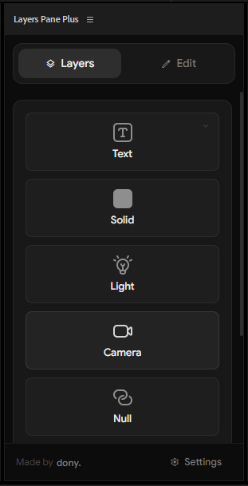
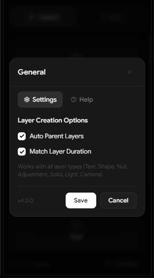

# Layers Pane Plus by dony.

[](README.md)
[](README_ES.md)
[](CHANGELOG.md)
[](#compatibility)
[](#compatibility)
[](#tech-stack)
[](LICENSE)

> **[Leer en Español](README_ES.md) | Read in English**

<p align="center">
  
  &nbsp;&nbsp;
  
</p>

## Description
Layers Pane Plus is an advanced extension for Adobe After Effects that provides extended functionality for layer creation and management. Previously distributed as a single script, Layers Pane Plus has evolved into a comprehensive CEP extension that offers a more robust, modern, and integrated After Effects experience.

## Current Version
**v4.0.0** - Major rewrite: migrated to a modern, modular architecture (React + TypeScript, bundled with Vite). Redesigned UI, a new Markers mover, and a far more maintainable codebase. See [CHANGELOG.md](CHANGELOG.md).

## What's New in v4.0.0
- **Rebuilt from the ground up** on a modular React + TypeScript codebase (bundled with Vite), replacing the previous single-file script — easier to maintain and extend.
- **Refreshed monochrome UI** built with accessible components (keyboard navigation, tooltips), keeping the familiar tabbed layout and custom icons.
- **New Markers tool:** detect existing markers in the active composition and reposition them — individually or as a group — working in frames, with a timecode display based on the composition's frame rate.
- **Responsive grid** (1–2 columns) and a cleaner unified Settings/Help modal.
- **Updated compatibility:** now targets After Effects 2022 (22.0) and newer.

## Installation

### For users (prebuilt extension)
1. Locate the Adobe After Effects CEP Extensions folder:
   ```
   C:\Program Files (x86)\Common Files\Adobe\CEP\extensions
   ```
   (or, per user: `%APPDATA%\Adobe\CEP\extensions`)
2. Place the entire built extension folder (`com.dony.LayersPanePlus`) in this directory.
3. Launch After Effects and open the extension via **Window > Extensions > Layers Pane Plus**.

> Unsigned development builds require enabling CEP debug mode once:
> ```
> reg add "HKCU\Software\Adobe\CSXS.11" /v PlayerDebugMode /t REG_SZ /d 1 /f
> ```

### For developers (build from source)
Requires **Node.js 20.19+ or 22.12+** (Vite 8 requirement).

```bash
npm install        # install dependencies
npm run dev        # start the Vite dev server (browser preview)
npm run build      # type-check + production build to dist/
npm run deploy     # build + copy to %APPDATA%\Adobe\CEP\extensions (local install)
npm run package    # build + zip dist/ into releases/ for distribution
```

After `npm run deploy`, restart After Effects to load the updated panel.

## Tech Stack
- **React 19** + **TypeScript** UI, bundled with **Vite** (`build.target: chrome88`).
- **react-aria-components** for accessible, keyboard-navigable controls.
- **CSS Modules** + design tokens (no Tailwind), monochrome "Studio Console" theme.
- Fonts/icons bundled locally (Google Sans + Material Symbols subset) — offline-safe, no CDN.
- **ExtendScript** host logic (`public/jsx/scripts.jsx`) bridged to the UI via `CSInterface.evalScript`.

## Compatibility
| Requirement | Minimum |
|---|---|
| After Effects | 2022 (22.0) |
| CEP runtime | 11 (Chromium 88) |

> The floor was raised to After Effects 22.0 because `duplicateLayer` relies on `Layer.id`, introduced in After Effects 22.0.

## Main Features
- Quick creation of various layer types: Text, Solid, Null Object, Shape, Camera, Light, Adjustment
- Deletion of selected layers with confirmation
- Layer sequencing based on selection order with reverse option
- Splitting of layers at the current time indicator with directional trim options
- Precomposing selected layers using the native After Effects dialog
- Creation of new compositions through the native After Effects dialog
- **Markers tool:** add markers to the composition (auto-numbered, gap-aware) or the selected layer, remove all markers, and **detect & reposition** existing markers — individually or as a group — in frames with a timecode display
- Auto Parent Layers (Compatible with all layer types)
- Match Layer Duration (Compatible with all layer types)
- Settings panel for customizing extension behavior
- User-friendly interface with icon buttons
- Dockable panel in the workspace
- Responsive and resizable UI

## Settings Options
- Auto Parent Layers: Automatically parent selected layers to new layers
- Match Layer Duration: New layers match the duration of selected layers
- Auto Delete Split Parts: Option to automatically delete split parts
- Trim Direction: Choose whether to keep the left or right side when splitting with auto delete enabled
- Show Delete Confirmation: Toggle confirmation dialog for layer deletion
- Reverse Sequence Order: Create layer sequences in reverse selection order

## Usage
1. Open Adobe After Effects
2. Go to **Window > Extensions > Layers Pane Plus**
3. Use the buttons to create different types of layers or perform actions
4. Access the Settings panel to customize script behavior
5. For layer sequencing:
   - Select layers in the desired order
   - Toggle "Reverse Order" option if needed
   - Click the sequence button
   - The extension will detect if layers are already sequenced and ask for confirmation
6. For creating layers with parenting or duration matching:
   - Enable desired options in Settings panel
   - Select target layer(s) - multiple layers supported for all layer types
   - Create new layer of any type (Text, Shape, Null, Solid, Light, Camera, or Adjustment)
7. For splitting layers:
   - Position the time indicator
   - Select specific layers or leave unselected for all layers
   - Click the split button
   - When "Auto Delete Split" is enabled, use the "Trim Direction" radio buttons to choose whether to keep the left or right side of the split
8. For precomposing:
   - Select layers to precompose
   - Click the precompose button
   - Use the native After Effects dialog
9. For Layer Settings:
   - Select only ONE layer (extension will warn if multiple layers are selected)
   - Click Layer Settings button
10. For Markers:
   - Choose the target (Comp or Layer) with the radio buttons
   - Click **Markers** to add a marker at the current time (comp markers are auto-numbered, reusing gaps; layer markers require a single selected layer)
   - Use **Remove all** to clear markers from the target
   - Open **Detect markers** to list existing markers and move them by frame — one at a time or all together while keeping their spacing

## Version History

For detailed version history and changelog, please see [CHANGELOG.md](CHANGELOG.md).

## Support
For help or to provide feedback, please contact me at:
[https://linktr.ee/Dony.ae](https://linktr.ee/Dony.ae)

Enjoy the extension and happy creating!